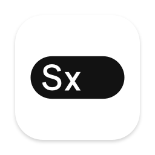
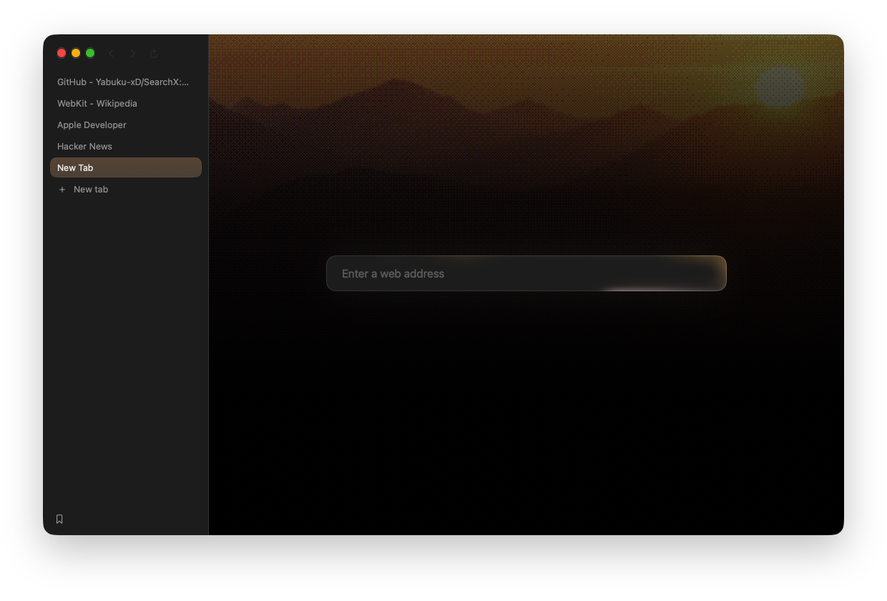

<div align="center">



# SearchX

**Search, extended.** A browser for the Mac that stays out of the way.

Small enough to forget it's there, fast enough to never wait on it,
and private because it has nowhere to send your data.

[](https://github.com/Yabuku-xD/SearchX/releases/latest)    [](LICENSE)

<br>



</div>

<br>

<table>
<tr>
<td align="center" width="25%"><h2>11.6 MB</h2>on disk, universal</td>
<td align="center" width="25%"><h2>324 ms</h2>to the first window</td>
<td align="center" width="25%"><h2>74 MB</h2>before the first page</td>
<td align="center" width="25%"><h2>11</h2>processes with five tabs</td>
</tr>
</table>

<sub>Release build on an Apple silicon Mac, median of three cold runs, measured with <code>python3 Tests/weigh.py</code>. SearchX runs on WebKit, the engine already inside macOS, so it carries no engine of its own. Tabs you leave for half an hour sleep and hand their memory back, and what you haven't opened, like web panels and containers, costs nothing until you do.</sub>

<br>

## What you get

<table>
<tr>
<td valign="top" width="50%">

### 🛡 Blocking, built in
uBlock Origin's default lists, kept current and enforced inside WebKit's networking, so ads and trackers are never even requested. Scriptlets stop pop-unders and anti-adblock walls. Pop-up blocking also watches **behaviour**: a window opened without a real click, or a click hijacked into an ad tab, is stopped on sites no list has ever named. Tracking parameters like `utm_`, `fbclid` and `gclid` are removed from links.

</td>
<td valign="top" width="50%">

### 🖼 A new tab that's yours
Pick any picture and SearchX redraws it as pixel art in the picture's own colours, falling to black around the address field. A soft light circles the field, white by default and in your picture's colours once you choose one, and the whole browser takes its colour from that picture.

</td>
</tr>
<tr>
<td valign="top">

### ⚡ Motion that keeps up
Pages run at 120 Hz on ProMotion displays when you allow it. A mouse wheel glides instead of stepping, while trackpads and mouse tools that already smooth, like LinearMouse or Mos, are left exactly as you set them. Scroll bars stay hidden until you scroll. The sidebar folds away and slides back from the edge, with adjustable delay and speed.

</td>
<td valign="top">

### 🗂 Tabs, your way
Across the top or down either side. Pinned tabs, colour-tagged groups you can split, sleep, bookmark, pin, or save and close for later, split view of up to four pages side by side, stacked or in a grid, Spaces, several windows and private windows. Shift-click a link to peek at it, then keep it as a tab or beside this one. Containers keep work and personal sign-ins apart in the same Space, each with its own cookies and site data. Sessions come back exactly as you left them.

</td>
</tr>
<tr>
<td valign="top">

### 🔑 Passwords in your keychain
SearchX offers to save a sign-in only after it has worked, and never fills anything on its own. Passkeys use the Mac's own sheet. Bring your passwords over from Chrome, Arc, Dia, Brave or Edge in one click.

</td>
<td valign="top">

### 🧩 Chrome extensions, no Chrome
Install from the Chrome Web Store on macOS 15.4 or later. SearchX fills in the Chrome APIs WebKit lacks, speaks Chrome's native messaging, and loads unpacked extensions for development.

</td>
</tr>
<tr>
<td valign="top">

### 📖 Read, watch, tidy
`⇧⌘R` reading mode. `⇧⌘P` floats a video above every app. `⇧⌘H` hides any element on a site for good. Pages and pictures translate on the Mac itself.

</td>
<td valign="top">

### ⌘K does the rest
`⌘K` finds open tabs, bookmarks and history, runs any menu command with its key shown, opens any page of Settings, and runs your command chains: several commands under one key, like New Tab then Split Side by Side. `⇧⌘F` is Focus Mode, the page and nothing else.

</td>
</tr>
<tr>
<td valign="top">

### 🪟 Web panels
Keep a chat, mail or calendar docked beside the page, in its desktop or mobile layout. A panel loads when you open it and lets go of its memory when you close it.

</td>
<td valign="top">

### 🔋 Saves power when you do
With macOS Low Power Mode on, or always if you like, pages draw at 60 Hz, background tabs sleep after five minutes, new pages wait for a click to play, and the new tab stays still.

</td>
</tr>
<tr>
<td valign="top" colspan="2">

### 🌐 Speaks your language
SearchX follows the Mac's language, including a per-app choice in System Settings › General › Language & Region. English, Japanese and Simplified Chinese today.

</td>
</tr>
</table>

Also: one field for addresses and searches with the engine you choose, bookmarks with folders and a bar, history, downloads, Speed Dial, element screenshots, site apps, editable shortcuts, light and dark appearance, and signed updates that install only when you say so.

## Privacy, by design

> No sync. No account. No telemetry. No server.
>
> The only things that leave your Mac are the pages you ask for, their icons, the filter lists, and one small request a day to see whether there's a newer version.

<details>
<summary><b>Where your data lives</b></summary>

<br>

| What | Where | Who can read it |
|---|---|---|
| Passwords | The macOS login keychain, as items tagged `Search` | SearchX, by its signature. Any other app triggers the system's permission dialog. |
| History, bookmarks, open tabs, hidden elements | Small JSON files in `~/Library/Application Support/Search/` | You. |
| Cookies and site data | WebKit's own store for the app | The sites that set them. |
| Extensions | `~/Library/Application Support/Search/Extensions/` and WebKit's extension store | Each extension, within the permissions you accepted. |

A private window (`⇧⌘N`) keeps its own temporary cookie jar and stays out of history and saved sessions.

</details>

<details>
<summary><b>Keyboard shortcuts</b></summary>

<br>

| Browse | Tabs | Tools |
|---|---|---|
| `⌘L` address | `⌘T` new tab | `⇧⌘R` reading mode |
| `⌘[` `⌘]` back, forward | `⌘W` close | `⇧⌘P` float the video |
| `⌘F` find | `⇧⌘T` reopen | `⇧⌘H` hide something |
| `⇧⌘C` copy address | `⌘K` tabs and commands | `⇧⌘U` what's hidden |
| `⇧⌘V` paste and go | `⇧⌘[` `⇧⌘]` previous, next | `⇧⌘B` bookmark |
| `⌘Y` history | `⌘1`–`⌘9` jump | `⌥⌘L` passwords |
| `⇧⌘J` downloads | `⌘D` duplicate | `⌘,` settings |
| | `⇧⌘S` top or side · `⌘S` fold | `⇧⌘F` focus mode |

Every binding can be changed in Settings › Shortcuts. The defaults live in [Shortcuts.swift](Sources/Search/Shortcuts.swift).

</details>

## Install

**Mac.** Download `SearchX.dmg` from the [latest release](https://github.com/Yabuku-xD/SearchX/releases/latest), open it and drag SearchX into Applications. It runs on macOS 14 or later, on Apple silicon and Intel.

This build isn't notarised by Apple yet, so the first time you open it macOS says it can't check it. Open **System Settings › Privacy & Security**, scroll down and click **Open Anyway** beside SearchX, then open it again. You only do this once.

**Linux (early preview).** Download `searchx-linux-x86_64.tar.gz` or `searchx-linux-arm64.tar.gz` from the same release. It needs GTK 4 and WebKitGTK 6.0 (`sudo apt install libgtk-4-1 libwebkitgtk-6.0-4` on Ubuntu 24.04), and the `README.txt` inside shows how to run or install it. The preview has tabs, the address field, the ad blocker and sessions; the rest of SearchX is still Mac-only (see [PORTING.md](PORTING.md)).

## Build it yourself

You need macOS 14 or later and a full Xcode with Swift 6.

```sh
swift build                        # debug build
swift test                         # tests
SEARCH_SIGN_IDENTITY= ./build.sh   # universal, ad-hoc signed build/SearchX.app
open build/SearchX.app
```

<details>
<summary><b>More build options</b></summary>

<br>

- Set `DEVELOPER_DIR` to Xcode's `Contents/Developer` folder if the command-line tools are selected.
- `ARCHS=arm64` builds one architecture, which is faster.
- `./build.sh release dmg` also makes `SearchX.dmg` and `SearchX.zip`; `./build.sh release ship` notarizes them with a Developer ID.
- An ad-hoc build needs right-click › Open on first launch, and keeps its passwords apart from a signed build's.

</details>

<details>
<summary><b>How it's put together</b></summary>

<br>

SwiftUI draws the interface, AppKit handles the window chrome, and WKWebView shows pages. There are no package dependencies beyond what Apple ships, and `Sources/Search/` keeps one file per concern:

| File | Job |
|---|---|
| `Shield.swift`, `Filters.swift` | Blocking |
| `FilterCompiler.swift`, `FilterWorker.swift` | Compiling filter lists in a short-lived helper process |
| `Scriptlets.swift`, `Intent.swift` | Scriptlets and behaviour-based pop-up blocking |
| `Wallpaper.swift`, `PixelArt.swift`, `Beam.swift` | The new tab picture and the address field light |
| `QuickCommands.swift`, `Chains.swift` | ⌘K's commands and command chains |
| `Split.swift`, `SplitStage.swift` | Split view of up to four pages |
| `WebPanels.swift`, `Containers.swift`, `SavedGroups.swift` | Web panels, containers and saved groups |
| `Power.swift`, `Sleep.swift`, `WheelGlide.swift` | Saving power, sleeping tabs and smooth wheel scrolling |
| `Vault.swift` | The keychain |
| `Extensions.swift`, `ExtensionShims.swift` | Chrome extensions |
| `Session.swift` | What comes back at launch |
| `Updater.swift` | Signed updates |

[PORTING.md](PORTING.md) describes the early Linux port.

</details>

<details>
<summary><b>Testing</b></summary>

<br>

Turn on Settings › General › Let a script drive SearchX, and `./bench` drives the running app over a private Unix socket:

```sh
./bench open https://example.com   # a tab of its own, marked with a flask
./bench wait <id>                  # until it has loaded
./bench text <id>                  # the page's text
./bench shot <id> out.png          # a screenshot
./bench click <id> "button.go"     # click, type and submit through the page's own events
./bench close all
```

Each end-to-end check runs its own temporary app and profile, and saves screenshots and a JSON report:

| Command | What it checks |
|---|---|
| `python3 Tests/local-resolution.py core` | Windows, tabs, sessions and the address field |
| `python3 Tests/audit-features.py` | Quick Commands, chains, focus, saving power, web panels, split views, groups, saved groups and containers |
| `python3 Tests/wheel-glide.py` | Mouse wheel steps glide; trackpads and smoothing mouse tools pass through untouched |
| `python3 Tests/weigh.py` | The size, launch time, memory and process count at the top of this page |

</details>

<br>

<div align="center">

<sub>Built by Shyamalan Kannan · MIT licensed, see <a href="LICENSE">LICENSE</a></sub>

</div>
